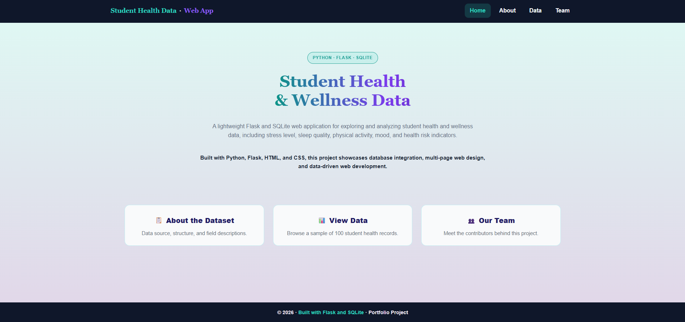
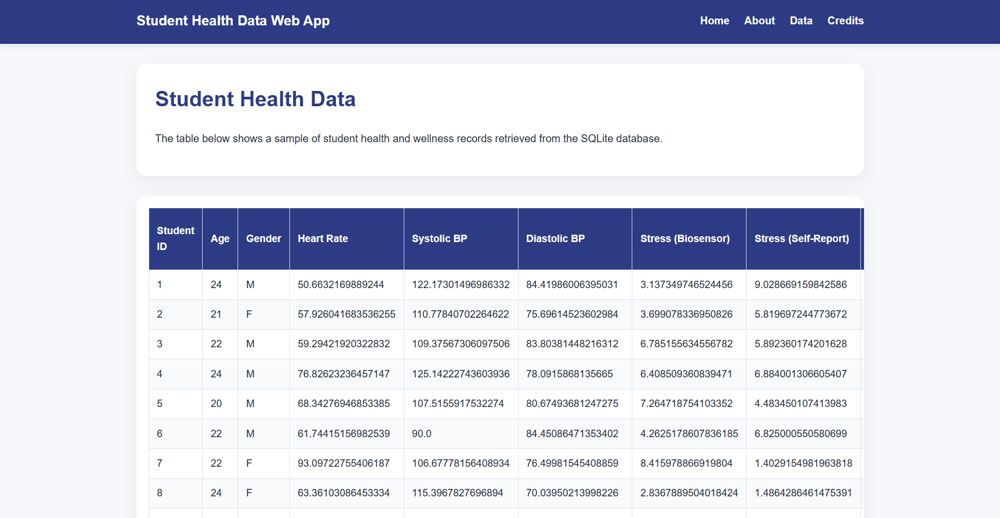

# Student Health Data Web App [](https://student-health-app.onrender.com)


## Overview
A lightweight Flask-based web application that integrates SQLite to explore and analyze student health and wellness data. The application provides an intuitive interface to visualize key indicators such as stress levels, sleep quality, physical activity, mood, and overall health risk.

This project demonstrates the integration of data analytics and backend development, transforming raw data into an interactive and user-friendly web experience.

## Deployment

This application is deployed on Render and automatically updates with every push to the main branch.

- Platform: Render
- Deployment type: Web Service
- Continuous Deployment: Enabled (auto-deploy on push)


## Application Preview
<p align="center">
  
</p>

<p align="center">
  
</p>

## Data Files
- `student_health_data.csv`: Raw dataset used for data ingestion and preprocessing  
- `student_health_data.db`: SQLite database used by the Flask application  
- `project.ipynb`: Jupyter Notebook used for importing the raw dataset, creating the SQLite database, and preparing the data displayed in the Flask web application

## Table of Contents
- [Features](#features)
- [Dataset](#dataset)
- [Tech Stack](#tech-stack)
- [Data Workflow](#data-workflow)
- [Project Structure](#project-structure)
- [Application Routes](#application-routes)
- [Installation & Setup](#installation--setup)
- [Project Evolution](#project-evolution)
- [Key Learning Outcomes](#key-learning-outcomes)
- [Key Highlights](#key-highlights)
- [Future Improvements](#future-improvements)

## Features
- Web application built with Flask
- Integration with SQLite database
- Multiple navigation pages using HTML templates
- Displays structured student health data
- Clean and simple user interface
- Modular and maintainable code structure

## Dataset
The dataset contains student health and lifestyle indicators used to assess health risks among college students.

- Age and Gender
- Heart Rate
- Blood Pressure (Systolic & Diastolic)
- Stress Level (Biosensor & Self-Report)
- Physical Activity (Low, Moderate, High)
- Sleep Quality (Poor, Moderate, Good)
- Mood (Happy, Neutral, Stressed)
- Study Hours
- Project Hours
- Health Risk Level (Low, Moderate, High)

Source: [Kaggle - Student Health Data](https://www.kaggle.com/datasets/ziya07/student-health-data)

## Tech Stack
- Python (Backend logic)
- Flask (Web framework)
- SQLite (Database)
- HTML / CSS (Frontend)
- Jinja2 (Templating)
- Pandas (Data processing)

## Data Workflow
- Raw data is ingested from a CSV dataset  
- Data preprocessing and transformation are performed using Python (Pandas)  
- Processed data is stored in an SQLite relational database  
- Flask serves as the backend framework to query and retrieve data  
- Jinja2 templates dynamically render the data into HTML views  
- The frontend presents structured data through an interactive web interface  

## Project Structure
```
student-health-flask-app/
│
├── app.py                      # Main Flask application
├── student_health_data.db      # SQLite database
├── project.ipynb               # Data cleaning and database creation
├── requirements.txt            # Project dependencies
│
├── templates/                  # HTML templates (Jinja2)
│   ├── base.html               # Base layout
│   ├── homepage.html           # Landing page
│   ├── about.html              # Dataset description
│   ├── data_table.html         # Data visualization page
│   └── group_info.html         # Project contributors
│
└── static/                     # Static files
    └── style.css               # CSS styling
```

## Application Routes
```
| Route  |           Description           |
|--------|---------------------------------|
| /      | Homepage                        |
| /about | Dataset and project description |
| /data  | Displays student health data    |
| /team  | Contributors information        |
```

## Installation & Setup
### 1. Clone the repository:
   ```
   git clone https://github.com/your-username/student-health-flask-app.git
   cd student-health-flask-app
   ```
### 2. Create virtual environment (optional but recommended):
   ```
   python -m venv venv
   source venv/bin/activate   # Mac/Linux
   venv\Scripts\activate      # Windows
   ```
### 3. Install dependencies:
    pip install --upgrade pip
    pip install -r requirements.txt
### 4. Run the application:
    python app.py
### 5. Open in browser:
    http://127.0.0.1:5000/

## Project Evolution
This project was initially developed as a collaborative academic assignment. 
It has since been independently enhanced and transformed into a portfolio project by Pamela Gatica, 
including improvements in:

- Code structure and organization  
- UI/UX design and styling  
- Documentation and project presentation  
- Application maintainability and scalability  

## Key Learning Outcomes
- Building a web application using Flask
- Connecting Python applications to an SQLite database
- Structuring a multi-page web app with templates
- Handling and displaying structured data
- Writing clean and maintainable backend code

## Key Highlights
- Full-stack data application using Python and Flask  
- Integration of structured datasets with a relational database  
- Clean and modern UI design for data accessibility  
- Conversion of an academic project into a professional portfolio application  

## Future Improvements
- Add filtering options (by gender, mood, health risk level)
- Implement pagination for large datasets
- Add data visualizations (charts and dashboards)
- Improve UI/UX design with CSS frameworks
- Deploy the application (e.g., Render, Railway, or Heroku)

## Author

**Pamela Gatica**  
Data Analytics Student | Background in Psychology & HR  
- Interested in data analytics, backend development, and data-driven applications  
- Currently building portfolio projects combining Python, data, and web development
  
## Final Note
This project is part of my journey into data analytics and backend development, focusing on transforming raw data into accessible and meaningful insights through simple web applications.
