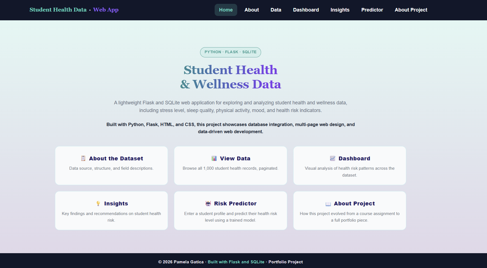

# Student Health Data Web App &nbsp; [](https://student-health-app.onrender.com)

A full-stack data web application built with Flask and SQLite for exploring and analyzing student health and wellness data. What started as a group course assignment evolved into a complete portfolio project with interactive dashboards, data-driven insights, and a machine learning risk predictor.

## Application Preview

<p align="center">
  
</p>

## Features

- **Filterable data table** — browse all 1,000 student records with pagination and filters by gender, activity level, sleep quality, mood, and health risk
- **Interactive dashboard** — 8 Plotly charts analyzing health risk by age, gender, stress, sleep quality, physical activity, and study hours
- **Insights page** — data-driven findings and recommendations derived from the dataset, with study limitations
- **ML Risk Predictor** — Random Forest model trained on the full dataset; input a student profile and get a predicted health risk level (Low / Moderate / High) with probability breakdown
- Deployed on Render with automatic redeployment on every push to `main`

## Tech Stack

| Layer | Tools |
|---|---|
| Backend | Python, Flask, SQLite |
| Data | Pandas, scikit-learn |
| Visualization | Plotly (Express + Graph Objects) |
| Frontend | HTML, CSS, Jinja2 |
| Deployment | Render |

## Dataset

1,000 synthetic student records with the following features:

- Age, Gender
- Heart Rate, Blood Pressure (Systolic & Diastolic)
- Stress Level (Biosensor & Self-Report, 0–10)
- Physical Activity (Low / Moderate / High)
- Sleep Quality (Poor / Moderate / Good)
- Mood (Happy / Neutral / Stressed)
- Study Hours / Week, Project Hours / Week
- **Health Risk Level** (Low / Moderate / High) — prediction target

Source: [Kaggle — Student Health Data](https://www.kaggle.com/datasets/ziya07/student-health-data)

## Application Routes

| Route | Description |
|---|---|
| `/` | Homepage with feature cards |
| `/about` | Dataset description and field reference |
| `/data` | Paginated, filterable data table |
| `/dashboard` | 8-chart interactive Plotly dashboard |
| `/insights` | Key findings and recommendations |
| `/predict` | ML health risk predictor form |
| `/group` | Project story and evolution |

## Project Structure

```
student-health-flask-app/
│
├── app.py                      # Flask routes and application entry point
├── dashboard.py                # Plotly chart builders (build_dashboard, build_insights)
├── ml_model.py                 # Random Forest pipeline (training + inference)
├── student_health_data.db      # SQLite database (1,000 records)
├── student_health_data.csv     # Raw dataset
├── project.ipynb               # Data ingestion and DB creation notebook
├── requirements.txt            # Python dependencies
│
├── templates/                  # Jinja2 HTML templates
│   ├── base.html               # Shared layout (nav, footer)
│   ├── homepage.html           # Landing page
│   ├── about.html              # Dataset description
│   ├── data_table.html         # Filterable data table
│   ├── dashboard.html          # Chart dashboard
│   ├── insights.html           # Insights and recommendations
│   ├── predict.html            # ML predictor form and result
│   └── group_info.html         # Project story
│
└── static/
    └── style.css               # All application styles
```

## Installation & Setup

### 1. Clone the repository
```bash
git clone https://github.com/pamela-gatica/student-health-flask-app.git
cd student-health-flask-app
```

### 2. Create and activate a virtual environment
```bash
python -m venv venv
source venv/bin/activate      # Mac / Linux
venv\Scripts\activate         # Windows
```

### 3. Install dependencies
```bash
pip install -r requirements.txt
```

### 4. Run the application
```bash
python app.py
```

### 5. Open in browser
```
http://127.0.0.1:10000/
```

## Machine Learning Model

The `/predict` route uses a `scikit-learn` Pipeline:

- **Preprocessing:** `StandardScaler` for numeric features, `OneHotEncoder` for categoricals
- **Model:** `RandomForestClassifier` (200 trees, balanced class weights, `random_state=42`)
- **Features:** all 12 columns (age, gender, biometrics, lifestyle, academic hours)
- **Training accuracy:** ~99% cross-validated — high because the dataset is synthetic with very clean patterns; real-world performance would be lower

The model trains lazily on the first `/predict` request using the live database.

## Project Evolution

This project began as a group assignment in a Python course (Data Analytics for Business program). The original scope was minimal: load a small dataset into SQLite and serve it through a basic Flask site.

After the course ended, I continued developing it independently to build it into a complete portfolio piece:

- Loaded the full 1,000-row dataset instead of a sample
- Added pagination and multi-field filters to the data table
- Built an interactive Plotly dashboard with 8 charts
- Added a dedicated Insights page with data-driven findings and limitations
- Built a machine learning Risk Predictor using Random Forest
- Redesigned the homepage, navigation, and overall visual styling
- Deployed on Render with continuous deployment

## Author

**Pamela Gatica**

Data Analytics | Psychology & HR

Interested in combining data analytics, backend development, and machine learning to turn raw data into accessible, meaningful applications.
